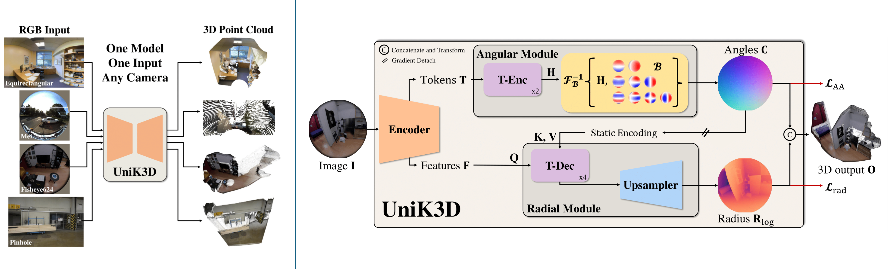

<div align="center">

# UniK3D: Universal Camera Monocular 3D Estimation

<a href="https://arxiv.org/abs/2503.16591"></a>
<a href='https://lpiccinelli-eth.github.io/pub/unik3d'></a>
<a href='https://huggingface.co/spaces/lpiccinelli/UniK3D-demo'></a>

</div>

<div>
  
</div>

<div>
  <p></p>
</div>

> [**UniK3D: Universal Camera Monocular 3D Estimation**](https://lpiccinelli-eth.github.io/pub/unik3d),
> Luigi Piccinelli, Christos Sakaridis, Mattia Segu, Yung-Hsu Yang, Siyuan Li, Wim Abbeloos, Luc Van Gool,
> CVPR 2025,
> *Paper at [arXiv 2503.16591](https://arxiv.org/pdf/2503.16591.pdf)*


## News and ToDo

- [ ] Rays to parameters optimization.
- [x] `21.03.2025`: Gradio demo and [Huggingface Demo](https://huggingface.co/spaces/lpiccinelli/UniK3D-demo).
- [x] `20.03.2025`: Training and inference code released.
- [x] `19.03.2025`: Models released.
- [x] `26.02.2025`: UniK3D is accepted at CVPR 2025!


## Visualization

<p align="center">
  
</p>

### Single 360 Image
<p align="center">
  
</p>

***Check more results in our [website](https://lpiccinelli-eth.github.io/pub/unik3d/)!***


## Installation

Requirements are not in principle hard requirements, but there might be some differences (not tested):
- Linux
- Python 3.10+ 
- CUDA 11.8+

Install the environment needed to run UniK3D with:
```shell
export VENV_DIR=<YOUR-VENVS-DIR>
export NAME=unik3d

python -m venv $VENV_DIR/$NAME
source $VENV_DIR/$NAME/bin/activate

# Install UniK3D and dependencies (more recent CUDAs work fine)
pip install -e . --extra-index-url https://download.pytorch.org/whl/cu121

# Install Pillow-SIMD (Optional)
pip uninstall pillow
CC="cc -mavx2" pip install -U --force-reinstall pillow-simd

# Install KNN (for evaluation only)
cd ./unik3d/ops/knn;bash compile.sh;cd ../../../
```

If you use conda, you should change the following: 
```shell
python -m venv $VENV_DIR/$NAME -> conda create -n $NAME python=3.11
source $VENV_DIR/$NAME/bin/activate -> conda activate $NAME
```

Run UniK3D on the given assets to test your installation (you can check this script as guideline for further usage):
```shell
python ./scripts/demo.py
```
If everything runs correctly, `demo.py` should print: `RMSE on 3D clouds for ScanNet sample: 21.9cm`.
`demo.py` allows you also to save output information, e.g. rays, depth and 3D pointcloud as `.ply` file.


## Gradio Demo

- Plase visit our [HugginFace Space](https://huggingface.co/spaces/lpiccinelli/UniK3D-demo) for an installation-free test on your images!
- You can use a local Gradio demo if the HuggingFace is too slow (CPU-based) by running `python ./gradio_demo.py` after installation.


## Get Started

After installing the dependencies, you can load the pre-trained models easily from [Hugging Face](https://huggingface.co/lpiccinelli) as follows:

```python
from unik3d.models import UniK3D

model = UniK3D.from_pretrained("lpiccinelli/unik3d-vitl") # vitl for ViT-L backbone
```

Then you can generate the metric 3D estimation and rays prediction directly from a single RGB image only as follows:

```python
import numpy as np
from PIL import Image

# Move to CUDA, if any
device = torch.device("cuda" if torch.cuda.is_available() else "cpu")
model = model.to(device)

# Load the RGB image and the normalization will be taken care of by the model
image_path = "./assets/demo/scannet.jpg"
rgb = torch.from_numpy(np.array(Image.open(image_path))).permute(2, 0, 1) # C, H, W

predictions = model.infer(rgb)

# Point Cloud in Camera Coordinate
xyz = predictions["points"]

# Unprojected rays
rays = predictions["rays"]

# Metric Depth Estimation
depth = predictions["depth"]
```

You can use ground truth camera parameters or rays as input to the model as well (be sure to run in `eval` mode):
```python
from unik3d.utils.camera import (Pinhole, OPENCV, Fisheye624, MEI, Spherical)

camera_path = "assets/demo/scannet.json" # any other json file
with open(camera_path, "r") as f:
    camera_dict = json.load(f)

params = torch.tensor(camera_dict["params"])
name = camera_dict["name"]
camera = eval(name)(params=params)
model.eval() # IMPORTANT: if not eval model, it will ignore input rays.
predictions = model.infer(rgb, camera)
```

To use the forward method for your custom training, you should:  
1) Take care of the dataloading:  
  a) ImageNet-normalization  
  b) Long-edge based resizing (and padding) with input shape provided in `image_shape` under configs  
  c) `BxCxHxW` format  
  d) If any intriniscs given, adapt them accordingly to your resizing  
2) Format the input data structure as:  
```python
data = {"image": rgb, "rays": rays}
predictions = model(data, {})
```

## Infer

To run locally, you can use the script `./scripts/infer.py` via the following command:

```bash
# Save the output maps and ply
python ./scripts/infer.py --input IMAGE_PATH --output OUTPUT_FOLDER --config-file configs/eval/vitl.json --camera-path CAMERA_JSON --save --save-ply
```

```
Usage: scripts/infer.py [OPTIONS]

Options:
  --input PATH                Path to input image.
  --output PATH               Path to output directory.
  --config-file PATH          Path to config file. Please check ./configs/eval.
  --camera-path PATH          (Optional) Path to camera parameters json file. See assets/demo
                              for a few examples. The file needs a 'name' field with
                              the camera model from unik3d/utils/camera.py and a
                              'params' field with the camera parameters as in the
                              corresponding class docstring.
  --resolution-level INTEGER  Resolution level in [0,10). Higher values means it will
                              resize to larger resolution which increases details but
                              decreases speed. Lower values lead to opposite.
  --save                      Save outputs as (colorized) png.
  --save-ply                  Save pointcloud as ply.
```

See also [`./scripts/infer.py`](./scripts/infer.py)


## Model Zoo

The available models are the following:

<table border="0">
    <tr>
        <th>Model</th>
        <th>Backbone</th>
        <th>Name</th>
    </tr>
    <hr style="border: 2px solid black;">
    <tr>
        <td rowspan="3"><b>UniK3D</b></td>
        <td>ViT-S</td>
        <td><a href="https://huggingface.co/lpiccinelli/unik3d-vits">unik3d-vits</a></td>
    </tr>
    <tr>
        <td>ViT-B</td>
        <td><a href="https://huggingface.co/lpiccinelli/unik3d-vitb">unik3d-vitb</a></td>
    </tr>
    <tr>
        <td>ViT-L</td>
        <td><a href="https://huggingface.co/lpiccinelli/unik3d-vitl">unik3d-vitl</a></td>
    </tr>
</table>

Please visit [Hugging Face](https://huggingface.co/lpiccinelli) or click on the links above to access the repo models with weights.
You can load UniK3D as the following, with `name` variable matching the table above:

```python
from unik3d.models import UniK3D

model_v1 = UniK3D.from_pretrained(f"lpiccinelli/{name}")
```

In addition, we provide loading from TorchHub as:

```python
backbone = "vitl"

model = torch.hub.load("lpiccinelli-eth/UniK3D", "UniK3D", backbone=backbone, pretrained=True, trust_repo=True, force_reload=True)
```

You can look into function `UniK3D` in [hubconf.py](hubconf.py) to see how to instantiate the model from local file: provide a local `path` in line 23.


## Training

Please visit the [docs/train](docs/train.md) for more information.


## Results

Please visit the [docs/eval](docs/eval.md) for more information about running evaluation..

### Metric 3D Estimation
The metrics is F1 over metric 3D pointcloud (higher is better) on zero-shot evaluation. 

| Model | SmallFoV | SmallFoV+Distort | LargeFoV | Panoramic |
| :-: | :-: | :-: | :-: | :-: |
| UniDepth | 59.0 | 43.0 | 16.9 | 2.0 |
| MASt3R | 37.8 | 35.2 | 29.7 | 3.7 |
| DepthPro | 56.0 | 29.4 | 26.1 | 1.9 |
| UniK3D-Small | 61.3 | 48.4 | 55.5 | 72.5 |
| UniK3D-Base | 64.9 | 50.2 | 67.7 | 73.7 |
| UniK3D-Large | 68.1 | 54.5 | 71.6 | 80.2 |


## Contributions

If you find any bug in the code, please report to Luigi Piccinelli (lpiccinelli@ethz.ch)


## Citation

If you find our work useful in your research please consider citing our publications:
```bibtex
@inproceedings{piccinelli2025unik3d,
    title     = {{U}ni{K3D}: Universal Camera Monocular 3D Estimation},
    author    = {Piccinelli, Luigi and Sakaridis, Christos and Segu, Mattia and Yang, Yung-Hsu and Li, Siyuan and Abbeloos, Wim and Van Gool, Luc},
    booktitle = {IEEE/CVF Conference on Computer Vision and Pattern Recognition (CVPR)},
    year      = {2025}
}
```


## License

This software is released under Creatives Common BY-NC 4.0 license. You can view a license summary [here](LICENSE).


## Acknowledgement

This work is funded by Toyota Motor Europe via the research project [TRACE-Zurich](https://trace.ethz.ch) (Toyota Research on Automated Cars Europe).
