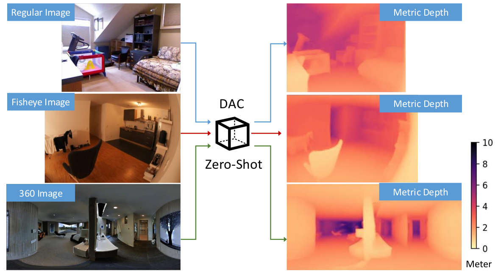
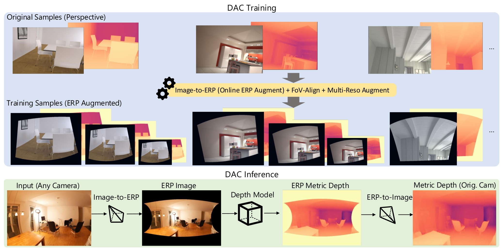

<div align="center">
<h1>Depth Any Camera: Zero-Shot Metric Depth Estimation from Any Camera</h1>

[**Yuliang Guo**](https://yuliangguo.github.io/)<sup>1*&dagger;</sup> · [**Sparsh Garg**](https://sparsh913.github.io/sparshgarg/)<sup>2&dagger;</sup> · [**S. Mahdi H. Miangoleh**](https://miangoleh.github.io/)<sup>3</sup> · [**Xinyu Huang**](https://scholar.google.com/citations?user=cL4bNBwAAAAJ&hl=en)<sup>1</sup> · [**Liu Ren**](https://sites.google.com/site/liurenshomepage/)<sup>1</sup> 

<sup>1</sup>Bosch Research North America&emsp;&emsp;&emsp;&emsp;<sup>2</sup>Carnegie Mellon University&emsp;&emsp;&emsp;&emsp;<sup>3</sup>Simon Fraser University&emsp;&emsp;&emsp;&emsp;

&emsp;*corresponding author&emsp;&dagger;equal technical contribution


<a href="https://arxiv.org/abs/2501.02464"></a>
<a href='https://yuliangguo.github.io/depth-any-camera/'></a>
<a href='https://huggingface.co/yuliangguo/depth-any-camera'></a>

[**CVPR 2025**](https://cvpr.thecvf.com/Conferences/2025)

</div>


<p align="center">
  
</p>

**Depth Any Camera (DAC)** is a zero-shot metric depth estimation framework that extends a perspective-trained model to handle any type of camera with varying FoVs effectively. 

Notably, DAC can be **trained exclusively on perspective images**, yet it generalizes seamlessly to **fisheye** and **360** cameras without requiring specialized training data. Key features include:

1. **Zero-shot metric** depth estimation on **fisheye** and **360** images, significantly outperforming prior metric depth SoTA [Metric3D-v2](https://jugghm.github.io/Metric3Dv2/) and [UniDepth](https://github.com/lpiccinelli-eth/UniDepth/tree/main).
2. Geometry-based training framework **adaptable to any network architecture**, extendable to **other 3D perception tasks**.

**Tired of collecting new data for specific cameras?** DAC maximizes the utility of every existing 3D data for training, regardless of the specific camera types used in new applications.

## News

- 2025-03-12: Add scripts to run fisheye scenes of ZipNeRF and ScanNet++ datasets. Results are downloadable from [ZipNeRF DAC results](https://huggingface.co/yuliangguo/depth-any-camera/blob/main/zipnerf_dac_swinl_indoor_2025_01.zip), and [ScanNet++ DAC results](https://huggingface.co/yuliangguo/depth-any-camera/blob/main/scannetpp_dac_swinl_indoor_2025_01.zip) to facilitate NeRF and Gaussian Splatting development.
- 2025-02-26: Depth Any Camera accepted by CVPR 2025!
- 2025-01-21: Demo code for easy setup and usage.
- 2025-01-13: Release of pre-trained DepthAnyCamera (DAC) models trained on moderately sized datasets.
- 2025-01-13: Testing and evaluation pipeline for zero-shot metric depth estimation on perspective, fisheye, and 360-degree datasets.
- 2025-01-13: Complete DepthAnyCamera (DAC) training pipeline using mixed perspective camera data.
- 2025-01-13: Complete data preparation and curation scripts.
- [TBD] Foundation-level model trained on a large-scale, diverse dataset mixture, encompassing perspective, fisheye, and 360-degree camera data.

## Visualization

### ScanNet++ fisheye

The zero-shot metric depth estimation results of Depth Any Camera (DAC) are visualized on ScanNet++ fisheye videos and compared to Metric3D-v2. The visualizations of A.Rel error against ground truth highlight the superior performance of DAC. 


<p align="center">
  
</p>

### Matterport3D single-view reconstruction

Additionally, we showcase DAC's application on 360-degree images, where a single forward pass of depth estimation enables full 3D scene reconstruction.

<p align="center">
  
</p>

Additional visual results and comparison with the prior SoTA can be found at <a href='https://yuliangguo.github.io/depth-any-camera/'></a>


## Performance

Depth Any Camera performs <b>significantly better</b> than the previous SoTA <b>metric</b> depth estimation models Metric3D-v2 and  UniDepth in zero-shot generalization to large FoV camera images given <b>significantly smaller training dataset and model size</b>.

| Method | Training Data Size | Matterport3D (360) || Pano3D-GV2 (360) || ScanNet++ (fisheye) || KITTI360 (fisheye) ||
|-|-:|:-:|:-:|:-:|:-:|:-:|:-:|:-:|:-:|
| | | AbsRel | $\delta_1$ | AbsRel | $\delta_1$ | AbsRel | $\delta_1$ | AbsRel | $\delta_1$ |
| UniDepth-VitL         | 3M                            | 0.7648 | 0.2576 | 0.7892  | 0.2469 | 0.4971 | 0.3638 | 0.2939 | 0.4810 |  
| Metric3D-v2-VitL      | 16M                           | 0.2924 | 0.4381 | 0.3070 | 0.4040 | 0.2229 | 0.5360 | 0.1997 | 0.7159 |  
| **Ours-Resnet101**    | 670K-indoor / 130K-outdoor  | **0.156** | **0.7727** | **0.1387** | **0.8115** | *0.1323*   | *0.8517*   | *0.1559*   | *0.7858* |
| **Ours-SwinL**        | 670K-indoor / 130K-outdoor  | *0.1789*  | *0.7231*   | *0.1836*   | *0.7287*   | **0.1282** | **0.8544** | **0.1487** | **0.8222** |

We highlight the **best** and *second best* results in **bold** and *italic* respectively (**better results**: AbsRel $\downarrow$ , $\delta_1 \uparrow$).

<!-- ## Pipeline

 -->


# Usage
## Installation
### Clone the Repository

```bash
git clone https://github.com/yuliangguo/depth_any_camera
cd depth_any_camera
```

### Docker Installation 
This repository can be run from within Docker, as long as the NVIDIA Container Toolkit is properly configured.
For Ubuntu Installation steps, refer to [this guide](https://github.com/garylvov/dev_env/tree/main/setup_scripts/nvidia).

```bash
# Build the container
docker build -t dac:latest .
# Enter the container
docker run --gpus all --network host -v $(pwd):/depth_any_camera --rm -it dac /bin/bash 

# Once within the container, 
#  source the post-entry-hooks.sh to finish the install.
source post-entry-hooks.sh
```

### Conda Installation
Alternatively, this repository can be run from within Conda alone.
```bash
conda create -n dac python=3.9 -y
conda activate dac
pip install torch==1.13.1+cu116 torchvision==0.14.1+cu116 torchaudio==0.13.1 --extra-index-url https://download.pytorch.org/whl/cu116

pip install -r requirements.txt
export PYTHONPATH="$PWD:$PYTHONPATH"
cd dac/models/ops/
pip install -e .
cd  ../../../
```

## Data Preparation

Our current training set is very slim compared to prior fundation models. Currently, DAC is trained on a combination set of 3 labeled datasets (670k images) for indoor model and a combination of 2 datasets (130k) for outdoor model. Two 360 datasets and two fisheye datasets are used for zero-shot testing.


Please refer to [DATA.md](docs/DATA.md) for detailed datasets preparation. Make sure the relative paths of datasets have been set correctly before proceeding to the actual testing and training sections.


## Pre-trained models

We provide two indoor models and two outdoor modeling considering Resnet101 and SwinTransformer-Large (SwinL) as backbones. In addition, we also provide two weaker baseline models for comparison. The download links can be found in the following table or from <a href='https://huggingface.co/yuliangguo/depth-any-camera'></a>. We suggest to save download both the **model configs and model weights** at `checkpoints` in order to run our scripts directly.

| Model Name | Training Datasets | Model Configs | Weights
|:-|:-:|:-:|:-:|
| dac-indoor-resnet101 (ours) | indoor mix 670k | [huggingface](https://huggingface.co/yuliangguo/depth-any-camera/blob/main/dac_resnet101_indoor.json)   | [huggingface](https://huggingface.co/yuliangguo/depth-any-camera/blob/main/dac_resnet101_indoor.pt)|
| dac-indoor-swinL (ours)     | indoor mix 670k | [huggingface](https://huggingface.co/yuliangguo/depth-any-camera/blob/main/dac_swinl_indoor.json) | [huggingface](https://huggingface.co/yuliangguo/depth-any-camera/blob/main/dac_swinl_indoor.pt)|
| dac-outdoor-resnet101 (ours) | outdoor mix 130k | [huggingface](https://huggingface.co/yuliangguo/depth-any-camera/blob/main/dac_resnet101_outdoor.json) | [huggingface](https://huggingface.co/yuliangguo/depth-any-camera/blob/main/dac_resnet101_outdoor.pt)|
| dac-outdoor-swinL (ours)    | outdoor mix 130k | [huggingface](https://huggingface.co/yuliangguo/depth-any-camera/blob/main/dac_swinl_outdoor.json) | [huggingface](https://huggingface.co/yuliangguo/depth-any-camera/blob/main/dac_swinl_outdoor.pt)|
| idisc-metric3d-indoor-resnet101 (weak baseline 1) | indoor mix 670k | [huggingface](https://huggingface.co/yuliangguo/depth-any-camera/blob/main/idisc_resnet101_indoor.json)   | [huggingface](https://huggingface.co/yuliangguo/depth-any-camera/blob/main/idisc_resnet101_indoor.pt)|
| cnndepth-metric3d-indoor-resnet101 (weak baseline 2) | indoor mix 670k | [huggingface](https://huggingface.co/yuliangguo/depth-any-camera/blob/main/cnndepth_resnet101_indoor.json)   | [huggingface](https://huggingface.co/yuliangguo/depth-any-camera/blob/main/cnndepth_resnet101_indoor.pt)|

## Demo

We have provided a ready-to-run demo scripts in the `demo` folder. `demo/demo_dac_indoor.py` demonstrates how to perform inference on various types of camera data, including ScanNet++ (fisheye), Matterport3D (360), and NYU (perspective), using a single metric depth model trained on perspective images. The code generates point cloud files `*.ply` and visualization results as shown below:

<p align="center">
  
</p>

`demo/demo_dac_outdoor.py` similarly demonstrates how a single outdoor model handle different types of camera data, including kitti (perspective) and kitti360 (fisheye).

Instead, we also provide demo script for dealing one sample, you may follow the following example command:

```bash
python demo/demo_dac_single.py --config-file checkpoints/dac_swinl_indoor.json --model-file checkpoints/dac_swinl_indoor.pt --sample-file demo/input/scannetpp_sample.json --out-dir demo/output
```

## Run on ZipNeRF (fisheye) and ScanNet++ (fisheye) Scenes

To better facilitate the development of Neural Reconstruction technique on fisheye inputs, e.g., [SMERF](https://smerf-3d.github.io/), [Fisheye GS](https://github.com/zmliao/Fisheye-GS), and [EVER](https://github.com/half-potato/ever_training), we provide scripts to conduct depth estimation on fisheye images for a whole scene folder.

```bash
python demo/run_dac_zipnerf_scene.py
python demo/run_dac_scannetpp_scene.py
```

Our depth results can be directly downloaded from [ZipNeRF DAC results](https://huggingface.co/yuliangguo/depth-any-camera/blob/main/zipnerf_dac_swinl_indoor_2025_01.zip), and [ScanNet++ DAC results](https://huggingface.co/yuliangguo/depth-any-camera/blob/main/scannetpp_dac_swinl_indoor_2025_01.zip). The results folder can be simply merged with the original dataset for further usage. The predicted depth maps are saved in uint16 images, with visualization as shown below. 

<p align="center">
  
</p>

**Important note**: Our depth maps record the Euclidean distance to the camera center instead of the z-distance to the image plane, which is not appropriate for large-FoV camera models.

## Testing

Given provided pretrained models saved in `checkpoints/`, the following code can be run to test and evaluate on certain dataset, e.g., ScanNet++:

```bash
python script/test_dac.py --model-file checkpoints/dac_swinl_indoor.pt --model-name IDiscERP --config-file configs/test/dac_swinl_indoor_test_scannetpp.json --base-path datasets --vis
```

Different config files for testing all the reported datasets are included in [configs/test](configs/test). Interested users could also refer to the provided [lauch.json](.vscode/launch.json) for convinient use or debug provided testing scripts in VSCode. The following tables lay out those most relative ones.

| Testing dataset | Testing script | --model-file | --config-file | --model-name |
|:-|:-|:-|:-|:-:|
| Matterport | scripts/test_dac.py           | checkpoints/dac-indoor-resnet101.pt          | [relative path](configs/test/dac_resnet101_indoor_test_m3d.json)       | IDiscERP |
| Gibson-V2 | ^                              | ^                                            | [relative path](configs/test/dac_resnet101_indoor_test_gv2.json)       | IDiscERP |
| ScanNet++ | ^                              | ^                                            | [relative path](configs/test/dac_resnet101_indoor_test_scannetpp.json) | IDiscERP |
| NYU     | ^                                | ^                                            | [relative path](configs/test/dac_resnet101_indoor_test_nyu.json)       | IDiscERP |
| KITTI360 | ^                               | checkpoints/dac-outdoor-resnet101.pt         | [relative path](configs/test/dac_resnet101_indoor_test_kitti360.json)  | IDisc    |
| KITTI   | ^                                | ^                                            | [relative path](configs/test/dac_resnet101_indoor_test_kitti.json)     | IDisc    |
| ...     | scripts/test_persp.py            | checkpoints/idisc-...                        | ...                                                                    | IDisc    |
| ...     | ^                                | checkpoints/cnndepth-...                     | ...                                                                    | CNNDepth |

**Note**: *IDiscERP* is our modified version of the *IDisc* model, incorporating isolated image and positional encoding features. It has been observed to improve results in small-size data training, particularly for better depth-scale equivariance. However, these modifications are not essential for large dataset training. *CNNDepth* refers to the CNN portion of the *IDisc* model, which serves as a network baseline but consistently underperforms compared to other models.

The ResNet101 models and configuration files can be replaced with the corresponding Swin-L versions. Ensure that the `--model-name` parameter matches the type of trained model. For users interested in comparing our DAC framework with the **Metric3D** training framework, we have provided pre-trained weak baselines along with their testing scripts, as detailed in the last two rows of the table.


## Training

To train metric depth estimation models under the **DepthAnyCamera (DAC)** framework, you can run the default code for indoor training datasets as follows:

```bash
python scripts/train_dac.py --config-file configs/train/hm3d+taskonomy+hypersim/hm3d+taskonomy+hypersim_dac_r101.json --base-path datasets --distributed --model-name IDiscERP
```

If you wish to train with a larger backbone, use the following command:

```bash
python scripts/train_dac_large.py --config-file configs/train/hm3d+taskonomy+hypersim/hm3d+taskonomy+hypersim_dac_swinl_s2.json --base-path datasets --distributed --model-name IDiscERP
```

For users interested in comparing our DAC framework with the **Metric3D** training framework, the following command can be used:

```bash
python scripts/train_persp.py --config-file configs/train/hm3d+taskonomy+hypersim/hm3d+taskonomy+hypersim_r101.json --base-path datasets --distributed --model-name IDisc
```

The corresponding testing script can be found at [scripts/test_persp.py](scripts/test_persp.py).

Similar commands apply to outdoor model training. There are various options available depending on the dataset or architecture. Interested users can refer to the table below for basic usage or consult the provided [launch.json](.vscode/launch.json) for convenient use or debugging in VSCode. We also provide all the training configurations we’ve used in [configs/train](configs/train).


| Training Target | Training script | --config-file | --model-name |
|:-|:-|:-|:-:|
| dac-indoor-resnet101          | scripts/train_dac.py           | [relative path](configs/train/hm3d+taskonomy+hypersim/hm3d+taskonomy+hypersim_dac_r101.json)       | IDiscERP or IDisc or CNNDepth  |
| dac-indoor-swinl              | scripts/train_dac_large.py     | [relative path](configs/train/hm3d+taskonomy+hypersim/hm3d+taskonomy+hypersim_dac_swinl_s2.json)   | IDiscERP or IDisc or CNNDepth  |
| dac-outdoor-resnet101         | scripts/train_dac.py           | [relative path](configs/train/ddad+lyft/ddad+lyft_dac_r101.json)                                   | IDiscERP or IDisc or CNNDepth  |
| dac-outdoor-swinl             | scripts/train_dac_large.py     | [relative path](configs/train/ddad+lyft/ddad+lyft_dac_swinl_s2.json)                               | IDiscERP or IDisc or CNNDepth  |
| metric3d-indoor-resnet101     | scripts/train_persp.py         | [relative path](configs/train/hm3d+taskonomy+hypersim/hm3d+taskonomy+hypersim_r101.json)           | IDisc or CNNDepth  |
| metric3d-indoor-swinl         | scripts/train_persp.py         | [relative path](configs/train/hm3d+taskonomy+hypersim/hm3d+taskonomy+hypersim_swinl.json)          | IDisc or CNNDepth  |
| metric3d-outdoor-resnet101    | scripts/train_persp.py         | [relative path](configs/train/ddad+lyft/ddad+lyft_r101.json)                                       | IDisc or CNNDepth  |
| metric3d-outdoor-swinl        | scripts/train_persp.py         | [relative path](configs/train/ddad+lyft/ddad+lyft_swinl_s2.json)                                   | IDisc or CNNDepth  |

## No camera parameters available?

State-of-the-art deep learning auto-calibration methods can rescue this situation. Consider using them to estimate the distorted camera parameters before applying our DAC.
- [Awesome-Deep-Camera-Calibration](https://github.com/KangLiao929/Awesome-Deep-Camera-Calibration)
- [OrdinalDistortion](https://github.com/KangLiao929/OrdinalDistortion)

## Acknowledgements
We thank the authors of the following awesome codebases:
- [iDisc](https://github.com/SysCV/idisc)
- [Metric3D](https://github.com/YvanYin/Metric3D)
- [UniDepth](https://github.com/lpiccinelli-eth/UniDepth)
- [OmniFusion](https://github.com/yuliangguo/OmniFusion)

For developers interested in multi-view-stereo designs contributing to the cross-camera generalization problem, we refer them to the following insightful works
- [nvTorchCam](https://github.com/NVlabs/nvTorchCam)
- [FoVA-Depth](https://research.nvidia.com/labs/lpr/fova-depth/)

## License
This software is released under MIT license. You can view a license summary [here](LICENSE).


## Citation

If you find our work useful in your research please consider citing our publication:
```bibtex
@inproceedings{Guo2025DepthAnyCamera,
  title={Depth Any Camera: Zero-Shot Metric Depth Estimation from Any Camera},
  author={Yuliang Guo and Sparsh Garg and S. Mahdi H. Miangoleh and Xinyu Huang and Liu Ren},
  booktitle={CVPR},
  year={2025}
}
```
