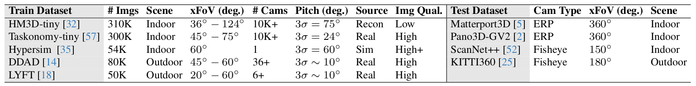

## Dataset Preparation Guidelines



Typically, the actual datasets are soft-linked to folders under the `datasets` directory. The required data structure for the datasets, including **KITTI** and **NYU**, is as follows:


```bash
depth_any_camera
├── datasets
│      ├── ddad
│      │     ├── 000000
│      │     ├── 000001
│      │     ├── 000002
│      │     ├── ...
│      ├── gibson_v2
│      │     ├── Adrian
│      │     ├── Aldine
│      │     ├── Alfred
│      │     ├── ...
│      ├── hm3d
│      │     ├── depth_euclidean
│      │     ├── mask_valid
│      │     ├── point_info
│      │     ├── rgb
│      │     ├── ...
│      ├── hypersim
│      │     ├── depth_euclidean
│      │     ├── mask_valid
│      │     ├── point_info
│      │     ├── rgb
│      │     ├── ...
│      ├── kitti
│      │     ├── 2011_09_26
│      │     ├── 2011_09_26_drive_0001_sync
│      │     ├── 2011_09_26_drive_0002_sync
│      │     ├── 2011_09_26_drive_0005_sync
│      │     ├── ...
│      ├── kitti360
│      │     ├── data_2d_raw
│      │     ├── project_depth
│      │     ├── fisheye
│      │     ├── ...
│      ├── lyft
│      │     ├── depth
│      │     ├── depth_val
│      │     ├── rgb
│      │     ├── rgb_val
│      │     ├── ...
│      ├── matterport3d
│      │     ├── 1LXtFkjw3qL
│      │     ├── 1pXnuDYAj8r
│      │     ├── 2azQ1b91cZZ
│      │     ├── 2n8kARJN3HM
│      │     ├── ...
│      ├── nyu
│      │     ├── basement_0001a
│      │     ├── basement_0001b
│      │     ├── bathroom
│      │     ├── bathroom_0001
│      │     ├── ...
│      ├── scannetpp
│      │     ├── data
│      │     ├── metadata
│      │     ├── splits
│      │     ├── ...
│      ├── taskonomy
│      │     ├── depth_euclidean
│      │     ├── mask_valid
│      │     ├── point_info
│      │     ├── rgb
│      │     ├── ...
│      │ ...        
│ ...
```

Please ensure that the dataset structure matches the one described below exactly, so that our config files and scripts can be directly utilized.

## Testing Datasets

### **Matterport3D (360)**
We use the version provided by [Pano3D](https://vcl3d.github.io/Pano3D/download/). After downloading the dataset, the actual data folder is soft-linked to `datasets/matterport3d`. Splits are saved [here](../splits/matterport3d) and are directly usable. Alternatively, you can use the [script](../splits/matterport3d/prepare_m3d_split_files_in_nyu_format.py) to regenerate the splits.

### **GibsonV2 (360)**
We use the version provided by [Pano3D](https://vcl3d.github.io/Pano3D/download/). Upon downloading, the dataset is soft-linked to `datasets/gibson_v2`. Splits are saved [here](../splits/gibson_v2) and are directly usable. Alternatively, use the [script](../splits/gibson_v2/prepare_gv2_split_files_in_nyu_format.py) to recreate the splits.

### **ScanNet++ (Fisheye)**
The dataset tested is a small subset of DSLR frames and labels from the official [ScanNet++](https://kaldir.vc.in.tum.de/scannetpp/) dataset. After downloading the raw data, ground-truth depth maps need to be rendered following their [instructions](https://github.com/scannetpp/scannetpp?tab=readme-ov-file#render-depth-for-dslr-and-iphone).

The dataset is soft-linked to `datasets/scannetpp`. Splits are saved [here](../splits/scannetpp), and we provide the [script](../splits/scannetpp/prepare_scannetpp_split_files_in_nyu_format.py) to regenerate the splits.

For benchmarking, we randomly selected 5 scenes from the first 50. You may consider downloading the following scenes for efficiency: `2a1a3afad9`, `1f7cbbdde1`, `4ef75031e3`, `1d003b07bd`, and `3e928dc2f6`. You can also use the DAC framework to combine the entire fisheye dataset with other datasets for training robust foundation 3D models.

We also provide a lookup table for fisheye cameras to assist with efficient data loading and visualization. The [script](../splits/scannetpp/create_fisheye_grid_scannetpp.py) generates this table per scene. **Note**: This step is crucial for ScanNet++ since the ground-truth depth uses z-buffer rendering. As discussed in our paper, using **Euclidean distance** for training and testing is essential for large FoV cameras.

### **KITTI360 (Fisheye)**
The dataset can be downloaded from the official [KITTI360 website](https://www.cvlibs.net/datasets/kitti-360/). Only the fisheye images and raw Velodyne scans are needed. In this [fork](https://github.com/yuliangguo/kitti360Scripts), we provide code to generate depth maps from lidar projections to each image. Use this [launch line](https://github.com/yuliangguo/kitti360Scripts/blob/d6acbf4f5eecc87d79b53a4e56a9fbd3d4aa690e/.vscode/launch.json#L31) to generate depth maps and split files. Once done, the lidar data can be removed to save space.

The dataset is soft-linked to `datasets/kitti360`, and previously generated splits are available [here](../splits/kitti360).

We also recommend downloading the 'fisheye' folder discussed in this [issue](https://github.com/autonomousvision/kitti360Scripts/issues/109), which includes helpful functions and files for handling fisheye cameras in KITTI360. You can use the provided lookup tables or the [script](../splits/kitti360/create_fisheye_grid_kitti360.py) to recreate them for just two cameras. There are useful fisheye masks included there too.

### **NYU**
You can download the dataset from [Google Drive](https://drive.google.com/file/d/1wC-io-14RCIL4XTUrQLk6lBqU2AexLVp/view?usp=share_link). The dataset is soft-linked to `datasets/nyu`, and splits are saved [here](../splits/nyu).

Though not widely known, the NYU dataset involves slight distortion, and distortion parameters are provided. We also offer a [script](../splits/scannetpp/create_fisheye_grid_scannetpp.py) to create the lookup table needed if you account for the distortion model of NYU. When applying DAC test, nyu images are converted to ERP considering distortion parameters, and we use the lookup table for converting visual results to original camera space.

### **KITTI**
Download the official dataset from [here](http://www.cvlibs.net/datasets/kitti/eval_depth.php?benchmark=depth_prediction), which includes raw data (~200GB) and fine-grained ground-truth depth maps. The dataset is soft-linked to `datasets/kitti`, and splits are saved [here](../splits/kitti).

---

## Training Datasets

The three major indoor datasets used for training are provided by [OmniData](https://github.com/EPFL-VILAB/omnidata/tree/main/omnidata_tools/dataset#readme). The package can be installed as follows:

```bash
conda install -c conda-forge aria2
pip install 'omnidata-tools'
```

### **Habitat-Matterport**
The Habitat-Matterport dataset can be downloaded by running:

```bash
omnitools.download point_info rgb depth_euclidean mask_valid --components hm3d --subset tiny --dest ./omnidata_hm3d --name your-name --email your-email --agree_all
```

We use the first 50 scenes to compose part of our indoor training data. Unfortunately, the full dataset (~8TB) must be downloaded before deleting the unused parts. After downloading, use the [script](splits/hm3d/prepare_hm3d_split_files_in_nyu_format.py) to generate split files.

The dataset is soft-linked to `datasets/hm3d`, and splits are saved [here](../splits/hm3d).

### **Taskonomy**
Omnidata provides the tiny version of Taskonomy, which we use for part of our indoor training data. Download it with:

```bash
omnitools.download point_info rgb depth_euclidean mask_valid --components taskonomy --subset tiny --dest ./omnidata_taskonomy_tiny --name your-name --email your-email --agree_all
```

After downloading, use the [script](../splits/taskonomy/prepare_taskonomy_split_files_in_nyu_format.py) to generate split files.

The dataset is soft-linked to `datasets/taskonomy`, and splits are saved [here](../splits/taskonomy).

### **Hypersim**
The full Hypersim dataset is used to compose part of our indoor training data. Download it with:

```bash
omnitools.download point_info rgb depth_euclidean mask_valid --components hypersim --subset fullplus --dest ./omnidata_hypersim --name your-name --email your-email --agree_all
```

After downloading, use the [script](../splits/hypersim/prepare_hypersim_split_files_in_nyu_format.py) to generate split files.

The dataset is soft-linked to `datasets/hypersim`, and splits are saved [here](../splits/hypersim).

### **DDAD**
Clone the [DDAD repository](https://github.com/TRI-ML/DDAD) and export it to your `PYTHONPATH`:

```bash
cd ..
git clone https://github.com/TRI-ML/dgp.git
export PYTHONPATH="$PWD/dgp:$PYTHONPATH"
```

Then run the code in `../splits/ddad` to download and process the dataset. Use the splits and info files from `../splits/ddad`. To download and process splits (e.g., train or val), use the following command:

```bash
cd ./depth_any_camera
python ./splits/ddad/get_ddad.py --base-path <BASE-PATH> --split <split-chosen>
```

The dataset is soft-linked to `datasets/ddad`, and splits and intrinsic parameters are saved [here](../splits/ddad).

### **LYFT**
The dataset can be downloaded from this [webpage](https://www.kaggle.com/c/3d-object-detection-for-autonomous-vehicles/data). After downloading, use the [script](../splits/lyft/generate_json_train.py) to prepare depth maps from the original object detection dataset for training, and another [script](../splits/lyft/generate_json_val.py) for validation. Use the [script](../splits/lyft/generate_splits.py) to generate NYU-style split files.

The dataset is soft-linked to `datasets/lyft`, and splits and intrinsic parameters are saved [here](../splits/lyft).

---

## Run-Time Camera Pose Estimation

For perspective datasets that do not provide camera poses, the essential pitch value can be estimated using third-party methods like [Perspective Field](https://github.com/jinlinyi/PerspectiveFields). Since the DAC framework does not rely on highly accurate camera poses for training or testing, deep estimated camera poses are sufficient.

Although using camera pitch is optional for testing, slight improvements were observed in our experiments on the NYU and ScanNet++ datasets, where we used deep-estimated camera poses for NYU and dataset-provided camera poses for ScanNet++.


